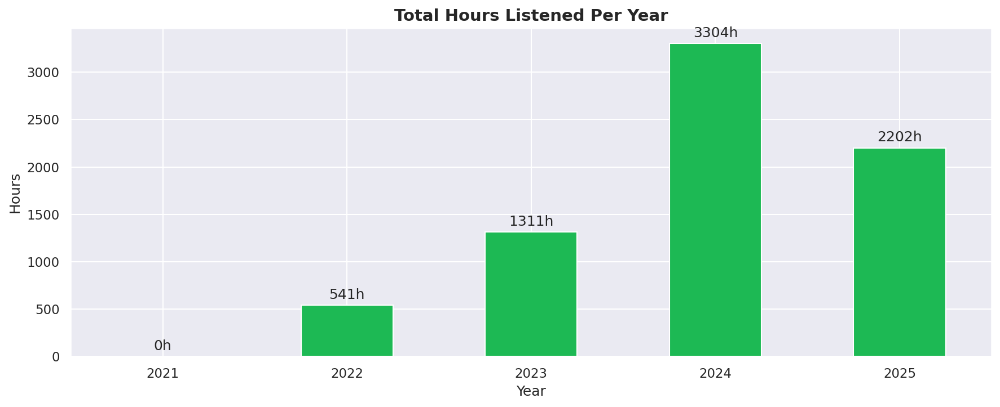
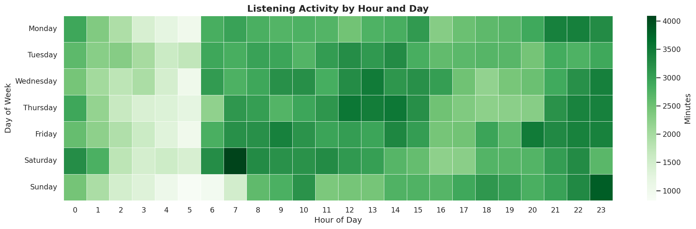
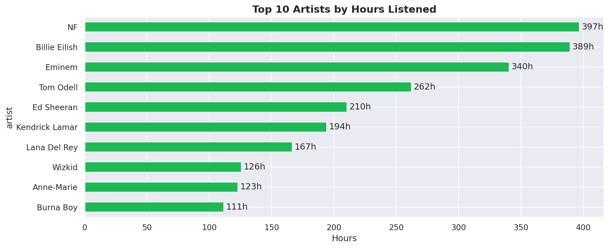

# 🎵 Spotify Listening Tracker

A personal data analytics app that transforms your Spotify extended streaming history into meaningful insights about your listening habits.

Built with Python, Streamlit, and the Spotify Web API.



---

## 📌 What It Does

Upload your raw Spotify JSON files and instantly get:

- **Overview stats** — total hours, streams, unique artists, tracks and albums
- **Listening streaks** — your longest consecutive listening streak and when it happened
- **Listening age** — the average age of songs you listen to, weighted by play time
- **Yearly trends** — how your listening volume changed year over year
- **Artist loyalty timeline** — your #1 artist each year, showing how your taste evolved
- **Monthly breakdown** — listening patterns within a selected year
- **Top artists, tracks, albums and genres** — ranked by actual hours played
- **Listening heatmap** — activity by hour of day and day of week
- **Skip analysis** — which artists you skip most and their skip rates
- **Platform breakdown** — mobile vs desktop vs other devices
- **Weekend vs weekday analysis** — with a two-sample t-test to determine if the difference is statistically significant
- **Time of day analysis** — morning, afternoon, evening or night, backed by a one-way ANOVA test
- **Listening personality** — your most loyal artist, peak hour, listening style and more

---

## 📊 Exploratory Analysis

The `notebooks/exploration.ipynb` notebook documents the full EDA process that informed the app's design, including hypothesis testing and statistical analysis.




---

## 🗂️ Project Structure
```
spotify-listening-tracker/
│
├── app/
│   └── main.py              # Streamlit dashboard
├── data/
│   ├── raw/                 # Your Spotify JSON files (gitignored)
│   └── processed/           # Cached API results (gitignored)
├── notebooks/
│   └── exploration.ipynb    # EDA and statistical analysis
├── outputs/                 # Saved chart images
├── src/
│   ├── __init__.py
│   ├── loader.py            # Data loading and cleaning
│   ├── analysis.py          # All analysis and statistical functions
│   ├── spotify_api.py       # Spotify Web API integration
│   └── genre_map.py         # Manual genre mapping and enrichment
├── tests/
│   ├── test_loader.py
│   └── test_analysis.py
├── .env                     # Spotify credentials (gitignored)
├── .gitignore
└── requirements.txt
```

---

## 🚀 Getting Started

### 1. Clone the repo
```bash
git clone git@github.com:kozah04/spotify-listening-tracker.git
cd spotify-listening-tracker
```

### 2. Create and activate environment
```bash
conda create -n spotify-tracker python=3.11
conda activate spotify-tracker
pip install -r requirements.txt
```

### 3. Set up Spotify API credentials

Create a free app at [developer.spotify.com](https://developer.spotify.com), then create a `.env` file in the project root:
```
SPOTIFY_CLIENT_ID=your_client_id_here
SPOTIFY_CLIENT_SECRET=your_client_secret_here
```

### 4. Get your Spotify data

1. Log into [spotify.com](https://spotify.com)
2. Go to **Account → Privacy Settings → Download your data**
3. Request **Extended Streaming History** (not the basic version)
4. Wait for Spotify's email — usually takes a few days
5. Download and unzip — you'll get several `Streaming_History_Audio_*.json` files

### 5. Run the app
```bash
streamlit run app/main.py
```

Upload your JSON files when prompted. Optionally click **Fetch Track & Genre Data** in the sidebar to enrich your data with release dates and genres via the Spotify API.

---

## 🧪 Running Tests
```bash
pytest tests/ -v
```

23 tests covering data loading, cleaning, analysis functions, and API utilities.

---

## 🔬 Statistical Methods Used

| Section | Method | Purpose |
|---|---|---|
| Weekend vs Weekday | Two-sample t-test | Tests if listening difference is statistically significant |
| Time of Day | One-way ANOVA | Tests if listening differs across four time periods |
| Listening Age | Weighted mean | Weights song age by minutes played |
| Genre Time | Proportional distribution | Distributes artist minutes equally across their genres |

---

## ⚙️ Tech Stack

- **Python 3.11**
- **Pandas** — data manipulation
- **Scipy** — statistical testing
- **Plotly** — interactive charts
- **Streamlit** — web app framework
- **Spotify Web API** — track metadata and genres
- **Pytest** — testing

---

## 📝 Notes

- Your raw data files are gitignored and never leave your machine
- API results are cached locally in `data/processed/` after the first fetch
- Genre data for African and Nigerian artists is manually curated due to gaps in Spotify's genre taxonomy
- Oldest/newest track stats reflect only tracks with available Spotify release data

---

## 👤 Author

**Gwachat Kozah**  
[GitHub](https://github.com/kozah04)